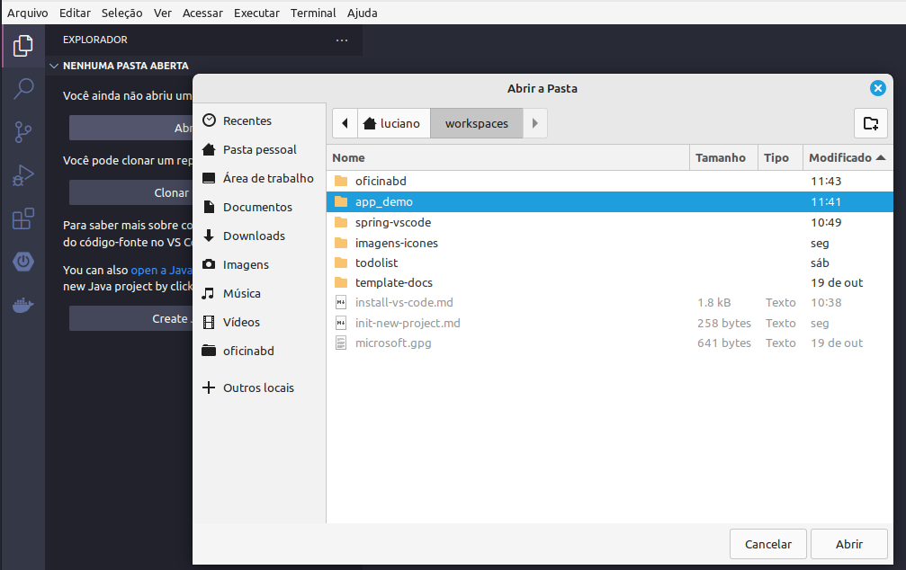

# Criando Projeto Java + Maven no VS Code

Abaixo estão as etapas para criação e validação de um projeto Java com o gerenciado de dependências Maven, utilizando a IDE do VS Code.

## Versão do Java SDK

Confirme se a versão do Java SDK é a correta ou compatível com o seu projeto. 

1. Na tela do prompt de comando ou shell do seu Sistema Operacional, execute:
```shell
java --version
```
2. Espera-se uma saída semelhante a:
```shell
Java 17.0.1
Java(TM) SE Runtime Environment
Java HotSpot(TM) 64-Bit Server VM
```
**_OBS.:_** Recomenda-se o uso do Java 17 ou superior.

## Extensão do Pacote Java no VS Code

Confirme se a extensão do pacote Java está instalado no seu VS Code.

1. Acesse o ícone de Extensões () e verifique se o Extension Pack for Java, Maven for Java e Project Manager for Java estão habilitados na sua IDE. Espera-se uma saída semelhante a:


**_OBS.:_** Recomenda-se o uso das extensões oficiais da Microsoft, para que haja compatibilidade futura.

## Etapas para Criação do Projeto em Java

Inicie um projeto Java com uma estrutura básica de diretórios, ou separações em camadas, ou com hierarquia de pacotes, considerando a necessidade ou a especificidade da aplicação projetada.

1. Acesse o botão `Create Java Project`.


2. Selecione a opção `Maven`.


3. Defina `maven-archetype-quickstart` na caixa texto ou selecione tal opção.


4. Na sequência selecione a versão  `1.4` (ou mais recente).


5. Especifique o pacote que será utilizado como grup Id, a exemplo de br.com.lucianokogut


6. Informe o nome do nome do projeto que ficará vinculado ao artifact Id do projeto como um todo (criando a classe principal como o App.java).


7. Indique o diretório onde ficará gravado o seu projeto.


8. Durante o processo de criação da estrutura de diretórios, atente-se para possíveis interações solicitadas via Terminal, a exemplo do valor da propriedade "version" como 1.0-SNAPSHOT.


Espera-se uma saída semelhante a:

9. Projeto criado, definido e disponível com a estrutura básica de diretórios.


10. Caso não seja aberto a estrutura de diretórios automaticamente, selecione no VS Code, o menu Arquivo > Abrir Pasta e selecione o diretório do projeto recém criado.



Com a estrutura final do projeto semelhante ao:

11. Conteúdo da imagem abaixo.


12. E ao executar o App.java teremos aquela famosa mensagem final esperada!


13. Refletindo na telinha preta, também...
