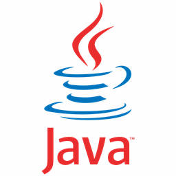
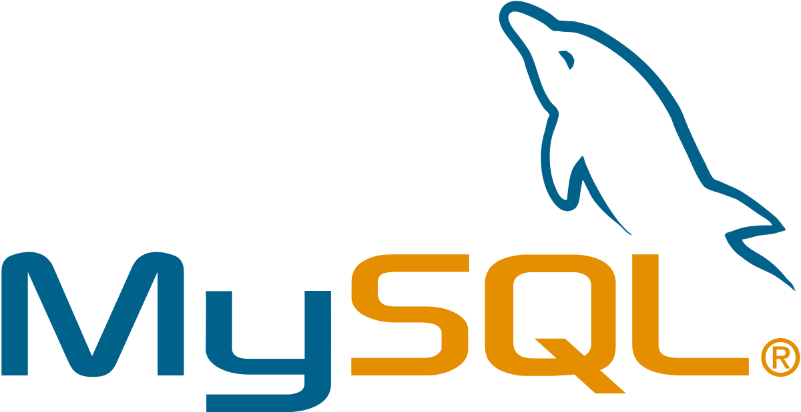
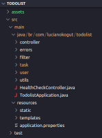

# Projeto de Tutoria Java para Oficina de Banco de Dados

Como parte deste projeto está direcionado à evolução do uso de outras IDE's, assim como de novas abordagens para Arquitetura de Software e sua própria documentação, aqui encontra-se uma estrutura que pode servir de modelo para seus próximos projetos em Java.

## 🎯 Índice

- [Visão Geral](#-índice)
- [Tecnologias Utilizadas](#-tecnologias-utilizadas)
- [Hierarquia de Pacotes](#hierarquia-de-pacotes)
- [Contribuição](#🤝-contribuição)

---

## 🌐 Visão Geral

Este projeto foi desenvolvido com base em uma demanda que antecede a Oficina de BD do professor Adriano de Melo que leciona na instituição. 

Como alguns processos seletivos estão exigindo conhecimento em VS Code junto com Java básico e Programação Orientada a Objetos (POO), o intuito é demonstrar na prática e por meio de um tutorial, todas as etapas necessárias para instalação e criação da estrutura inicial de um projeto em Java.

Caso tenha interesse em conhecer o tutorial básico de Java com Maven, [acesse aqui](JAVA-MAVEN.md)

- [Visão Geral](#-índice)
---

## 🛠 Tecnologias Utilizadas

* Java 17
* Maven
* MySQL 8.0
* Hierarquia de Pacotes
* Arquitetura MVC

|LOGO           |STACK                              |FUNÇÃO                       |
|---------------|-----------------------------------|-----------------------------|
|  | `Java 17` | Linguagem de programação escolhida para o desenvolvimento do Back-end da aplicação |
|  | `Maven 4.0` | Ferramenta de gerenciamento para o build de código-fonte (construção dos artefatos para sua execução), pois padroniza o gerenciamento de dependências, a execução dos testes, o build e deploy da aplicação |
|   | `MySQL 8.0.32` | Gerenciador de Banco de Dados de código aberto |
|   | `Hierarquia de Pacotes` | Organização dos diretórios (pastas do projeto) dentro de responsabilidades específicas para cada uma das entidades implementadas |

- [Visão Geral](#-índice)
---

## Hierarquia de Pacotes

Conceito relacionado ao conjunto de classes localizadas na mesma estrutura hierárquica de diretórios, geralmente agrupadas em pacotes comuns entre si, com o propósito de facilitar a reutilização de código.

```shell
.
└── OFICINABD/
    ├── src/
    │   ├── main/
    │   │   └── java/br/com/lucianokogut/
    │   │       ├── controller
    │   │       ├── model
    │   │       │   ├── bo
    │   │       │   ├── dao
    │   │       │   └── vo
    │   │       ├── view
    │   │       ├── Main.java
    │   │       └── TodolistApplication.java
    │   └── test
    ├── Dockerfile
    ├── pom.xml
    └── README.md
```

Fonte: https://tree.nathanfriend.io/

- [Visão Geral](#-índice)
---

## 🤝 Contribuição

Estamos dispostos a ouvir suas sugestões para o andamento das aulas e a interdisciplinariedade do curso.

Tendo alguma outra demanda, entre em contato com os professores Adriano ou Luciano.

[Adriano](adriano.melo@prof.sc.senac.br)

[Luciano](luciano.kogut@prof.sc.senac.br)

- [Visão Geral](#-índice)
---